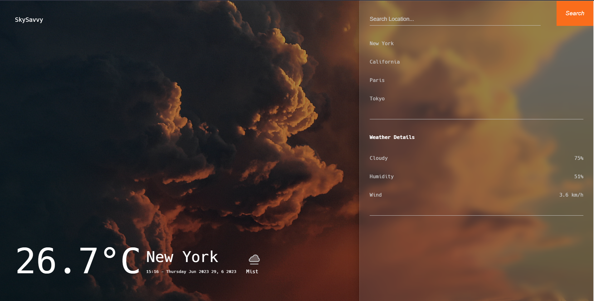
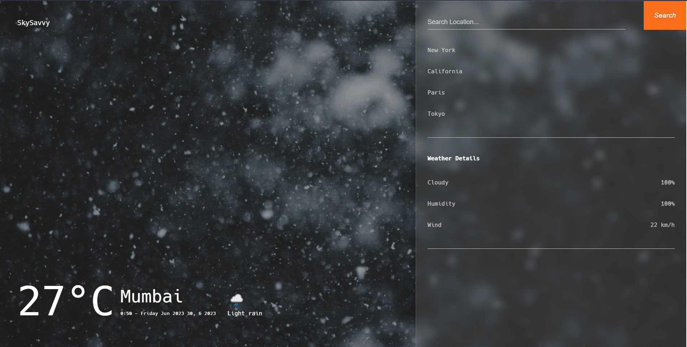

# WeatherNow

WeatherNow is a modern weather application that provides real-time weather information for cities around the world. Stay updated on the current weather conditions, temperature, humidity, wind speed, and more with this intuitive and responsive application.

## 📦 Features

- Real-time weather information for any city
- Temperature displayed in Celsius
- Weather condition icons for easy visualization
- Interactive search to find cities quickly
- Quick access to popular cities
- Responsive design for seamless experience on different devices

## 📝 Demo

Check out the live demo of WeatherNow [here](https://geneticscrol.github.io/SkySavvy/).

## 📷 Screenshots






## 📋 Installation

1. Clone the repository:

   ```bash
   git clone https://github.com/Geneticscrol/SkySavvy.git

2. Navigate to the project directory:

    ```bash
    cd SkySavvy

3. Open index.html in your preferred web browser.

## 💡 Usage

Enter the name of a city in the search input and press Enter or click the search button.
The current weather information for the specified city will be displayed, including temperature, weather condition, date, and time.
Click on any of the popular cities to view their weather information.

## ⚙️ Technologies Used

HTML
CSS
JavaScript
WeatherAPI

## 👥 Contributing

Contributions are welcome! If you find any issues or have suggestions for improvements, please create a new issue or submit a pull request.

## 📄 License

This project is licensed under the MIT License.

## ⚠️ Please make sure to replace the placeholders (`your-demo-link`, `your-username`) with the appropriate information relevant to your project.
